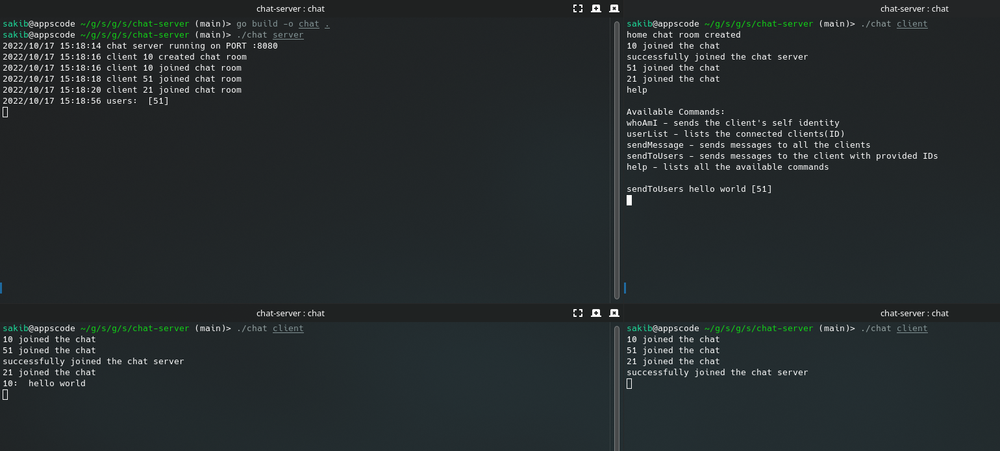

# Demo Chat Server using Cobra CLI on Top of TCP

## Build

```bash
$ go build -o chat .

```

## Available commands for the CLI

```bash
$ ./chat --help

Usage:
  chat [flags]
  chat [command]

Available Commands:
  client      connects the client to the chat server
  completion  Generate the autocompletion script for the specified shell
  help        Help about any command
  server      starts the chat server

Flags:
  -h, --help   help for chat

```

## Start the chat server

```bash
$ ./chat server

```

## Join the chat server as a client (an Unique ID will be assigned to the client on joining)

```bash
# open several windown & run this command
$ ./chat client

# each client will be assigned a randomly generated ID within range of int64

10 joined the chat
successfully joined the chat server

10 joined the chat
51 joined the chat
successfully joined the chat server

10 joined the chat
51 joined the chat
21 joined the chat
successfully joined the chat server

```

## Available commands for the connected client

```bash
# Join & run help
$ help

help

Available Commands:
whoAmI - sends the client's self identity
userList - lists the connected clients(ID)
sendMessage - sends messages to all the clients
sendToUsers - sends messages to the client with provided IDs
help - lists all the available commands

```

## Expected output for the client commands

```bash
# for the client with ID 21
$ whoAmI
whoAmI? My ID 21

# list the users
$ userList
10, 51, 21

# send messages to all the users
# all the connected users will receive this message
$ sendMessage hello world!

# send message to users providing their IDs along with message
# only the connected users from the usersList will receive the message
# IDs must be enclosed by []
$ sendToUsers hello world [21, 51]

```

## Static Demo

### whoAmI command demo

<p class="has-text-centered">
  
</p>


### sendMessage <message> command demo

<p class="has-text-centered">
  
</p>

### sendToUsers <message> []userList command demo

<p class="has-text-centered">
  
</p>
